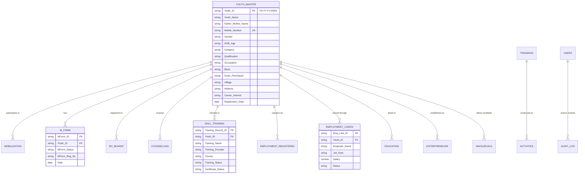
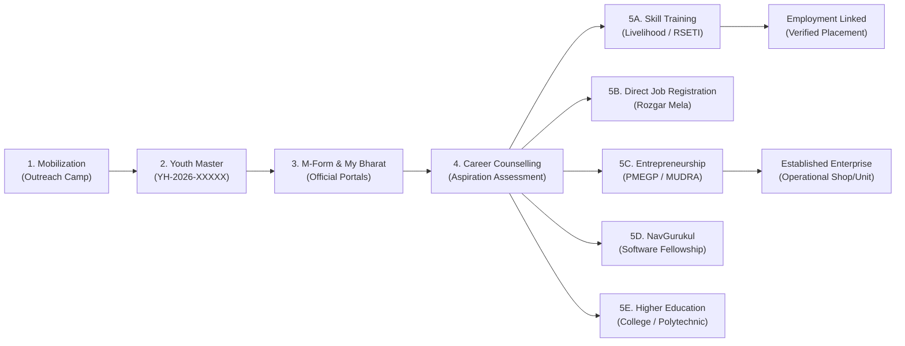

# YOUTH HUB DANTEWADA
## Youth Mobilization, Counselling, Skill, Employment & Entrepreneurship Monitoring System
### जिला प्रशासन, दंतेवाड़ा • District Administration, Dantewada (Chhattisgarh)

A complete digital monitoring, data entry, database, dashboard, and reporting system built specifically for the Youth Hub Dantewada district administration and field staff.

---

## 1. System Architecture & Relational Database Design

The system runs on a **Serverless Government Cloud Stack**:
- **Frontend**: Vanilla ES6+ JavaScript, HTML5, CSS3, Chart.js (Mobile-first, bilingual Hindi/English).
- **Backend**: Google Apps Script (REST Web App API).
- **Database**: Google Sheets (16 relational sheets linked by unique `Youth_ID`).
- **File Storage**: Google Drive (dedicated `YouthHub_Dantewada_Uploads` folder for photos/documents).

### Relational Entity-Relationship Diagram (ERD)

### The Youth Progression Journey

---

## 2. Google Sheets Database (16 Sheets)

The database consists of 16 structured sheets created automatically:

| # | Sheet Name | Description | Key Fields |
|---|---|---|---|
| 1 | `Youth_Master` | Primary Master Directory of Youth | `Youth_ID`, `Youth_Name`, `Mobile_Number`, `Block`, `Gram_Panchayat` |
| 2 | `Mobilization` | Village & GP Outreach Events | `Activity_ID`, `Total_Mobilized`, `Male`, `Female`, `Photo_URL` |
| 3 | `M_Form` | Official District M-Form Tracking | `MForm_ID`, `Youth_ID`, `MForm_Status`, `MForm_Reg_No` |
| 4 | `My_Bharat` | National Youth Portal Registrations | `MyBharat_ID`, `Youth_ID`, `MyBharat_Reg_No`, `Status` |
| 5 | `Counselling` | Individual Career Guidance Sessions | `Counselling_ID`, `Youth_ID`, `Counselling_Type`, `Outcome` |
| 6 | `Skill_Training` | Institutional Skill Training Records | `Training_Record_ID`, `Youth_ID`, `Training_Provider`, `Course` |
| 7 | `Employment_Registered` | Candidates Registered for Placement | `Emp_Reg_ID`, `Youth_ID`, `Preferred_Job`, `Registration_Status` |
| 8 | `Employment_Linked` | Verified Placements & Offer Letters | `Emp_Link_ID`, `Youth_ID`, `Employer_Name`, `Salary`, `Status` |
| 9 | `Education` | Higher Education Linkage | `Education_ID`, `Youth_ID`, `Institution_Name`, `Course` |
| 10 | `Entrepreneurs` | Identified & Established Enterprises | `Entrepreneur_ID`, `Youth_ID`, `Business_Idea`, `Loan_Amount`, `Stage` |
| 11 | `NavGurukul` | 1-Year Coding Fellowship Pipeline | `Candidate_ID`, `Youth_ID`, `Selection_Status`, `Admission_Status` |
| 12 | `Trainings` | Activity-level Workshops & Bootcamps | `Training_ID`, `Training_Name`, `Total_Participants`, `Photos_URL` |
| 13 | `Activities` | Field Visits, Gram Sabhas, SHG Meetings | `Activity_ID`, `Activity_Type`, `Participants`, `Outcome` |
| 14 | `Users` | User Credentials & Access Control | `User_ID`, `Email`, `Password_Hash`, `Role`, `Block` |
| 15 | `Settings` | District Configuration & Versioning | `Key`, `Value`, `Description` |
| 16 | `Audit_Log` | Security & Compliance Action Logs | `Log_ID`, `Timestamp`, `User_Email`, `Action`, `Module` |

---

## 3. Dantewada Administrative Structure

- **District**: Dantewada (दंतेवाड़ा), Chhattisgarh
- **Blocks (4)**:
  1. **Dantewada**: Chitalanka, Bhansi, Teknar, Balpet, Dantewada Rural, Kamlur, Madkamiras, Gadhpal
  2. **Geedam**: Barsoor, Haram, Gumalnar, Kasoli, Geedam Rural, Pondum, Javanga, Karli
  3. **Katekalyan**: Marjum, Parcheli, Tumakpal, Bengpal, Katekalyan Rural, Bodenar, Telam, Gatam
  4. **Kuakonda**: Mailawada, Nakulnar, Sameli, Palnar, Kuakonda Rural, Bacheli Rural, Hitawar, Durgapur
- **Youth Hubs**:
  - Youth Hub Dantewada (District HQ)
  - Youth Hub Geedam (Skill & Innovation)
  - Youth Hub Katekalyan
  - Youth Hub Kuakonda

---

## 4. Default System Users & Roles

Pre-configured users loaded during database initialization:

| Role | Email | Password | Access Level |
|---|---|---|---|
| **ADMIN** | `admin@dantewada.gov.in` | `Admin@Dantewada2026` | Full district access, all modules, user administration, reports |
| **DATA OPERATOR** | `operator@dantewada.gov.in` | `Operator@2026` | Data entry across all modules, view dashboard |
| **BLOCK USER** | `kate.user@dantewada.gov.in` | `Block@Kate2026` | Restricted strictly to Katekalyan block data entry & view |
| **BLOCK USER** | `kua.user@dantewada.gov.in` | `Block@Kua2026` | Restricted strictly to Kuakonda block data entry & view |
| **VIEWER** | `viewer@dantewada.gov.in` | `Viewer@2026` | District Collector / Senior Viewer read-only dashboard & reports |

*Note: The login dialog provides 1-click quick login buttons for all these roles for instantaneous testing.*

---

## 5. Step-by-Step Deployment Instructions

### Step 1: Create the Google Sheet
1. Open [Google Sheets](https://sheets.new) and create a new blank spreadsheet.
2. Name the spreadsheet: `YOUTH_HUB_DANTEWADA_DATABASE`.

### Step 2: Open Apps Script Editor
1. In the Google Sheet, go to the top menu: **Extensions &rarr; Apps Script**.
2. Rename the Apps Script project to `YouthHub_Backend`.

### Step 3: Copy Apps Script Files
In the Apps Script editor, create the following 7 `.gs` script files and paste the corresponding code from the `YouthHub/AppsScript/` directory:
- `Utils.gs`
- `Database.gs`
- `Auth.gs`
- `Dashboard.gs`
- `Reports.gs`
- `Upload.gs`
- `Code.gs`

*(Optional: If you want Apps Script to host the HTML directly, create an HTML file named `index.html` in Apps Script and paste the contents of `YouthHub/index.html`)*

### Step 4: Run Database Initialization
1. In the Apps Script toolbar, select the function **`setupDatabase`** from the function dropdown.
2. Click **Run**.
3. A Google prompt **"Authorization Required"** will appear:
   - Click **Review Permissions**.
   - Select your Google Account.
   - Click **Advanced &rarr; Go to YouthHub_Backend (unsafe)**.
   - Click **Allow** (Grants permission to edit the sheet and manage upload folders in Google Drive).
4. Check your Google Sheet: All 16 tabs will now be automatically generated with dark navy headers!

### Step 5: Populate Realistic Sample Data
1. Select the function **`createSampleData`** from the Apps Script function dropdown.
2. Click **Run**.
3. All 10 sample youth records, mobilization events, M-Forms, counselling, skill, and employment records will be inserted.

### Step 6: Create Web App Deployment
1. At the top right of Apps Script, click **Deploy &rarr; New deployment**.
2. Click the gear icon (**Select type**) &rarr; choose **Web app**.
3. Configure settings:
   - **Description**: `Youth Hub Dantewada Production v2`
   - **Execute as**: **`Me (your-email@gmail.com)`** *(Crucial: allows field operators to save data into your sheet without requiring personal Google accounts)*
   - **Who has access**: **`Anyone`**
4. Click **Deploy**.
5. Copy the generated **Web App URL** (e.g. `https://script.google.com/macros/s/AKfycb.../exec`).

### Step 7: Connect Frontend Application
1. Open `YouthHub/index.html` in any modern web browser (or host on GitHub Pages).
2. Click **Settings & Database** in the left sidebar.
3. Paste your Web App URL into the **Google Apps Script Web App URL** input field and click **Save URL**.
4. Click the 1-Click **District Admin** login button.
5. All live KPIs, 10 Chart.js charts, reports, and data entry forms are now connected live to your Google Sheet!
